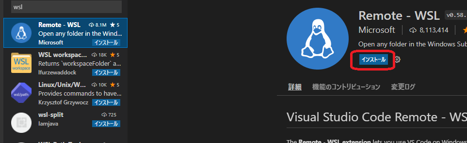

# Visual Studio Code (Windows)

[Home.md](./README.md)

---

## Windows へのインストール

[Visual Studio Code](https://code.visualstudio.com/download)から`System installer`の`windows 64bit`をクリックしてダウンロードする。

- インストーラの指示は、ほぼデフォルトで良い。
- デスクトップ上にアイコンを作成にはチェックをすること。

インストールが完了したらデスクトップ上のショートカットをダブルクリックするなどして起動する。

- 「表示言語を日本語に変更するには・・・」の表示が出たら「インストールして再起動」をクリックする。

## WSL と連携させる

Visual Studio Code の左方にある拡張機能のボタンを押し、検索ボックスで「wsl」と入力して「Remote WSL」を表示させ、クリックする。

インストールボタンを押す。

リモートエクスプローラボタンを押すと「Ubuntu-18.04」が表示されるので、右にある「Connect to WSL」ボタンを押す。  
すると、新しい VSCode のウィンドウが開くので、以降そちらで作業する。

メニューから「フォルダを開く」を選択する。

開くフォルダを入力するボックスが現れるので`/home/oit/catkin_ws/src`を選択する。  
`oit`の部分は、`WSL`インストール時に入力したユーザ名に応じて変わる。

このようなダイアログが出たら、「全てのファイルの作成者を信頼します」をチェックし「信頼します」を押す。

ウィンドウ左側に`/home/oit/catkin_ws/src`以下のフォルダ一覧が表示される。

「Reload window to activate ?」のような質問には「Yes」を、「Don't Show Again」という選択肢がある質問には「Don't Show Again」を押す。

「OK」という選択肢がある質問には「OK」を押す。

`Ctrl+Shift+@`を押すと、コマンドターミナルを表示できる。ここで`WSL`を使い生成された Linux 仮想環境に対してコマンド入力ができる。

- 「＋」マークはターミナルを増やして、複数コマンドを同時に実行する際に使う。
- 「ゴミ箱」マークは不要なターミナルを削除する際に使う。
